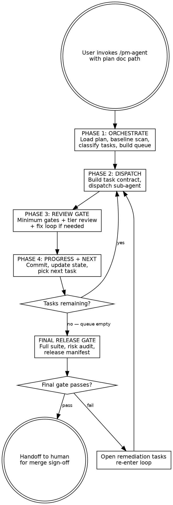
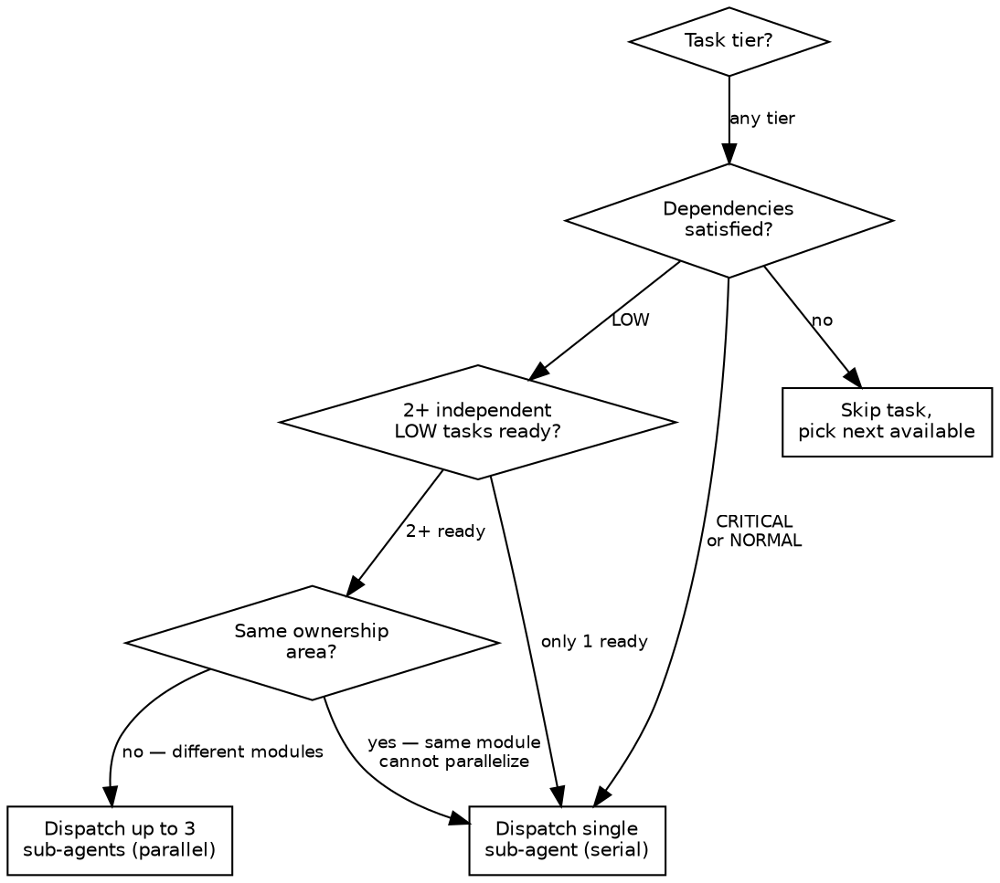
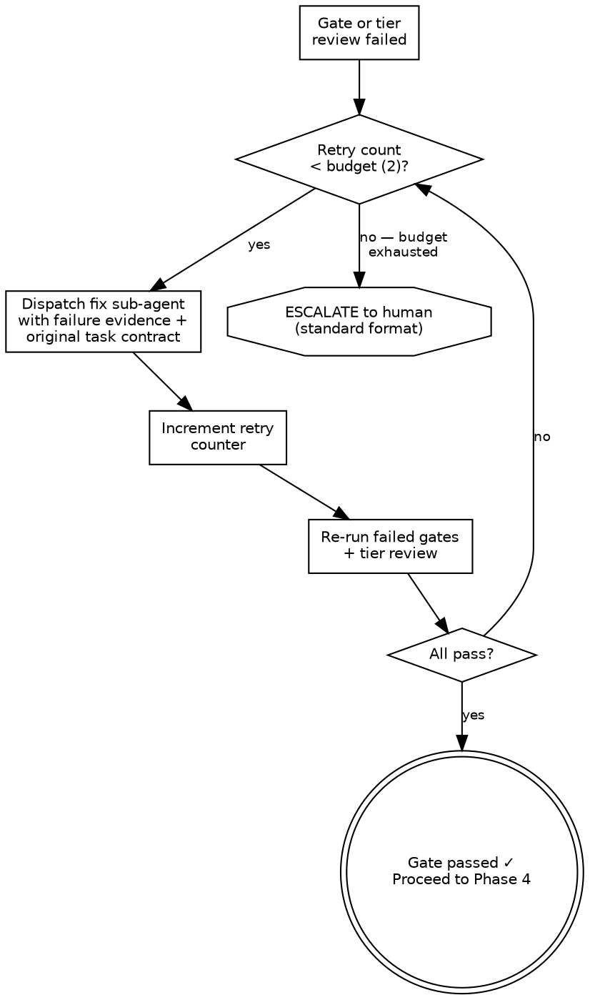

# PM Agent Skill — Implementation Plan

> **For Claude:** REQUIRED SUB-SKILL: Use superpowers:executing-plans to implement this plan task-by-task.

**Goal:** Build a Claude Code skill (`pm-agent`) that acts as an autonomous project manager — reads plan docs, dispatches sub-agents, reviews code with tiered depth, enforces quality gates, and drives projects to completion.

**Architecture:** Single skill file (`SKILL.md`) with supporting reference files for templates and checklists. Installed at `~/.claude/skills/pm-agent/`. Follows TDD approach: baseline test → write skill → pressure test → refactor.

**Tech Stack:** Claude Code skill system (YAML frontmatter + Markdown), Graphviz flowcharts, structured templates

---

## Phase 1: Skill Infrastructure

### Task 1: Create skill directory and frontmatter

**Files:**
- Create: `~/.claude/skills/pm-agent/SKILL.md`

**Step 1: Create directory**

```bash
mkdir -p ~/.claude/skills/pm-agent
```

**Step 2: Write SKILL.md with frontmatter and overview**

```markdown
---
name: pm-agent
description: Use when you have a design doc + implementation plan in docs/plans/ and want autonomous end-to-end project delivery — dispatches sub-agents to implement tasks, reviews code with tiered depth (critical/normal/low), enforces quality gates, and drives the plan to completion. Triggers: "run the plan", "implement this project", "be the PM", starting a new implementation from existing docs.
---

# PM Agent — Autonomous Project Manager

## Overview

You are the Project Manager. You own all decisions about scope, sequencing, and quality. Sub-agents only execute — they never decide scope, never commit, never merge. Human retains final merge authority.

**Input:** Path to design doc + plan doc in `docs/plans/`

**Your job:**
1. Read the plan, figure out what's done vs. remaining
2. Dispatch sub-agents to implement tasks with tight contracts
3. Review every task with depth proportional to risk
4. Enforce quality gates — no exceptions
5. Drive to completion, then hand off to human

## When to Use

- You have existing design + plan documents in `docs/plans/`
- The plan has multiple tasks to implement
- You want autonomous execution with minimal human intervention
- You want tiered code review and quality enforcement
```

**Step 3: Commit**

```bash
cd ~/.claude/skills/pm-agent
git init
git add SKILL.md
git commit -m "feat: pm-agent skill — frontmatter and overview"
```

---

### Task 2: Write the core loop flowchart and state store spec

**Files:**
- Modify: `~/.claude/skills/pm-agent/SKILL.md` (append after overview)

**Step 1: Add core loop section**

Append the following after the "When to Use" section:

````markdown
## Core Loop



## State Store

Maintain this state throughout the session. This is your memory — consult and update it after every action.

**Global state** (set once during init, updated per task):
- `plan_id` — plan document identifier
- `baseline_sha` — git SHA at session start
- `current_sha` — SHA after latest commit
- `shared_context` — compact project context block (built once in Phase 1, never re-scanned)
- `unresolved_risks[]` — accumulated across all tasks
- `checkpoint_tags[]` — tags after passed critical tasks

**Per-task state:**
- `task_id`, `title`, `tier` (critical/normal/low), `ownership` (module/service)
- `status` — pending | ready | in_progress | completed | failed | escalated
- `retry_count` — fix attempts so far (max 2)
- `commit_sha` — set after commit
- `artifacts[]` — files produced
- `review_note` — { summary, risks[], rollback }
- `duration_ms` — dispatch → gate pass
- `decision_log[]` — why you made each decision

Use `TaskCreate` / `TaskUpdate` / `TaskList` to track tasks. Use state store for PM-level metadata that tools don't capture.
````

**Step 2: Commit**

```bash
cd ~/.claude/skills/pm-agent
git add SKILL.md
git commit -m "feat: add core loop flowchart and state store spec"
```

---

## Phase 2: The Four Phases

### Task 3: Write Phase 1 — Orchestrate

**Files:**
- Modify: `~/.claude/skills/pm-agent/SKILL.md` (append after state store)

**Step 1: Add Phase 1 section**

Append:

````markdown
## Phase 1: ORCHESTRATE

Run this phase ONCE at the start of the session.

### Step 1.1: Load plan

1. Read the design doc and plan doc from the paths the user provided
2. Parse all tasks from the plan doc (look for `### Task N:` headers)
3. For each task, extract: title, files to create/modify, acceptance criteria, test commands

### Step 1.2: Baseline scan (one-time only)

1. Run `git log --oneline -20` to understand recent history
2. Run `git status` to check working tree state
3. Use Glob to map the project file tree (top-level + key packages)
4. Run the project's test suite once to establish baseline (note any pre-existing failures)
5. Record `baseline_sha` from `git rev-parse HEAD`

### Step 1.3: Build shared context block

Build a compact text block (aim for <500 words) containing:
- Project name and purpose (from design doc)
- Tech stack and key dependencies
- Directory structure (packages, key file paths)
- Naming conventions and code style (from existing code)
- Design principles and constraints (from design doc)

Store this once. You will inject it into every sub-agent dispatch — do NOT re-scan the codebase each time.

### Step 1.4: Diff plan vs. reality

For each task in the plan:
- Check if the expected files already exist (Glob)
- Check if the expected tests exist and pass
- Classify: `EXISTS` (skip) / `PARTIAL` (needs work) / `MISSING` (full implementation needed)

### Step 1.5: Classify tasks

Assign a tier to each remaining task:

| Tier | Criteria | Examples |
|------|----------|----------|
| **CRITICAL** | Auth, billing/finops, data integrity, schema migrations, security, public API, infrastructure | Login flow, payment processing, DB migration, API versioning |
| **NORMAL** | Features, handlers, integrations, internal APIs | New endpoint, message handler, service integration |
| **LOW** | UI copy, refactors, docs, config, dev tooling | README update, rename variable, add config option |

**Auto-escalation:** If a task touches auth, schema, billing, secrets, or public API → force CRITICAL regardless of initial classification.

### Step 1.6: Build execution queue

1. Sort by dependency (topological order)
2. Within same dependency level: CRITICAL first, then NORMAL, then LOW
3. Mark tasks as `ready` if all dependencies are satisfied
4. Record the full queue in state store
5. Create TaskCreate entries for all tasks

**Output:** Announce the queue to the user:
```
PM AGENT — Plan loaded
Plan: [name]
Total tasks: X (Y remaining)
  CRITICAL: N (serial)
  NORMAL: N
  LOW: N (parallelizable where independent)
Skipped (already done): N
Starting with: Task [id] — [title]
```
````

**Step 2: Commit**

```bash
cd ~/.claude/skills/pm-agent
git add SKILL.md
git commit -m "feat: add Phase 1 — Orchestrate"
```

---

### Task 4: Write Phase 2 — Dispatch

**Files:**
- Modify: `~/.claude/skills/pm-agent/SKILL.md` (append after Phase 1)
- Create: `~/.claude/skills/pm-agent/task-contract-template.md`

**Step 1: Add Phase 2 section to SKILL.md**

Append:

````markdown
## Phase 2: DISPATCH

Run this phase for each task. Build a tight contract, dispatch a sub-agent, collect results.

### Step 2.1: Build task contract

Before dispatching, assemble the full contract. See `task-contract-template.md` for the schema.

Key fields:
- **acceptance_criteria** — from the plan doc, verbatim
- **expected_files** — create / modify / delete (from plan doc)
- **tests_to_add** — new tests the sub-agent must write
- **tests_to_run** — existing tests to execute after implementation
- **non_goals** — what this task must NOT touch (prevents scope creep)
- **io_contract** — dependencies consumed, artifacts produced, interfaces exposed, `breaking_change: yes/no`
- **environment** — exact lint/typecheck/test commands to run
- **ownership** — which module/service is affected

### Step 2.2: Check security flags

If the task touches ANY of these, auto-escalate tier to CRITICAL:
- Authentication / authorization
- Database schema / migrations
- Billing / finops / costs
- Secrets / environment variables
- Public API surface

### Step 2.3: Check budgets

- **Patch size:** If expected files > 15, split the task into subtasks first
- **Retry budget:** 2 fix attempts max (tracked in state store)
- **Time budget:** Set a reasonable timeout based on task complexity

### Step 2.4: Dispatch sub-agent

Use the `Task` tool to dispatch. The sub-agent prompt MUST include:

1. **Role:** "You are implementing task [id] of [plan name]. Follow the contract exactly."
2. **Shared context block** (from Phase 1 — compact, not re-scanned)
3. **Task-specific delta:** files to read, recent changes from prior tasks, relevant decisions
4. **Full task contract** (all fields from Step 2.1)
5. **Instructions:**
   - Use appropriate skills as the situation demands (TDD, debugging, verification)
   - Do NOT commit — the PM handles commits after review
   - Return structured output (see below)
6. **Required return format:**

```
FILES_CHANGED:
  created: [list]
  modified: [list]
  deleted: [list]

TEST_RESULTS:
  tests_added: [list with pass/fail]
  tests_run: [list with pass/fail]
  evidence: [key output lines from test run]

LINT_TYPECHECK:
  lint: pass/fail
  typecheck: pass/fail
  evidence: [key output lines]

BLOCKERS: [list or "none"]
RISKS: [list or "none"]
SELF_ASSESSMENT: confident | uncertain | blocked
```

### Step 2.5: Dispatch rules



### Step 2.6: Pre-dispatch escalation

STOP and escalate to human if:
- Task requirements are ambiguous (use escalation format)
- Task depends on a blocked/failed task with no workaround
- No tasks available (all blocked)

**Escalation format (always use this template):**
```
ESCALATION
Problem:     [what failed or is ambiguous]
Impact:      [what's blocked, downstream effects]
Options:     [2-3 concrete options]
Recommended: [your best judgment]
Blocking:    yes/no
```
````

**Step 2: Create task contract template**

Write `~/.claude/skills/pm-agent/task-contract-template.md`:

```markdown
# Task Contract Template

Use this template when building the dispatch prompt for each sub-agent.

## Required Fields

```yaml
task_id: "task-XX"
title: "Short descriptive title"
tier: critical | normal | low
ownership: "package/module name"

acceptance_criteria:
  - "Criterion 1 (from plan doc, verbatim)"
  - "Criterion 2"

expected_files:
  create:
    - "exact/path/to/new/file.py"
  modify:
    - "exact/path/to/existing/file.py"
  delete: []

non_goals:
  - "Do NOT modify [file/module]"
  - "Do NOT change [existing behavior]"

tests_to_add:
  - "tests/path/test_new_feature.py::test_specific_case"

tests_to_run:
  - "tests/path/test_existing.py"

io_contract:
  dependencies:
    - "task-XX artifacts: [list]"
  artifacts:
    - "path/to/produced/file"
  expected_interfaces:
    - "ClassName.method_name(args) -> return_type"
  breaking_change: false

environment:
  lint_command: "ruff check path/to/package"
  typecheck_command: "mypy path/to/package"
  test_command: "pytest tests/path/ -v"
  build_command: null

definition_of_done:
  - "Code implements all acceptance criteria"
  - "tests_to_add written and passing"
  - "tests_to_run all passing"
  - "Lint + typecheck pass"
  - "No TODO/FIXME without linked follow-up task"
  - "Docs updated if public API or config changed"
  - "Migration + rollback notes if schema/infra changed"

budgets:
  retry_budget: 2
  patch_size_limit: 15
```
```

**Step 3: Commit**

```bash
cd ~/.claude/skills/pm-agent
git add SKILL.md task-contract-template.md
git commit -m "feat: add Phase 2 — Dispatch + task contract template"
```

---

### Task 5: Write Phase 3 — Review Gate

**Files:**
- Modify: `~/.claude/skills/pm-agent/SKILL.md` (append after Phase 2)
- Create: `~/.claude/skills/pm-agent/review-gate-checklist.md`

**Step 1: Add Phase 3 section to SKILL.md**

Append:

````markdown
## Phase 3: REVIEW GATE

Run after every sub-agent returns. This is where quality is enforced. No shortcuts.

### Step 3.1: Collect evidence

1. Parse sub-agent's structured return (files, tests, lint, blockers, risks, self-assessment)
2. Run `git diff --stat` to verify actual changes match expected files
3. Check security flags on actual changed files (not just planned files):
   - If changes touch auth/schema/billing/secrets/public API → auto-escalate tier to CRITICAL
4. Store raw evidence in state store for audit

### Step 3.2: Minimum gate (all tiers — mandatory, no exceptions)

Run these 6 gates in order. ALL must pass.

| # | Gate | How to Check | Pass Criteria |
|---|------|-------------|---------------|
| 1 | **Plan alignment** | Map each acceptance criterion to a specific file + code change | Every criterion has evidence |
| 2 | **Tests added** | Verify `tests_to_add` files exist and pass | All new tests written and green |
| 3 | **Tests run** | Execute `tests_to_run` from environment contract | All existing tests still green |
| 4 | **Lint + typecheck** | Run environment contract commands | Zero errors |
| 5 | **No orphan TODOs** | Grep changed files for `TODO\|FIXME\|HACK\|XXX` | Each has a linked follow-up task |
| 6 | **Review note** | Sub-agent provided: what changed, risks, rollback | All three fields present |

**ANY gate fails → enter Fix Loop (Step 3.4).**
**ALL gates pass → proceed to Tier Review (Step 3.3).**

### Step 3.3: Tier review

**CRITICAL tier:**
1. Dispatch a code-reviewer sub-agent with the full diff + design doc context
2. Run ALL impacted test suites (not just tests for this task)
3. Security scan: no secrets in code, no injection vectors, no unvalidated input in changed files
4. Data integrity: if migration, verify it's reversible
5. If `breaking_change: true` → create release notes artifact
6. ALL checks must pass

**NORMAL tier:**
1. Dispatch a code-reviewer sub-agent with changed files + plan alignment check
2. Run targeted test suites for the affected module (from `ownership` field)
3. Quick pattern scan: no obvious anti-patterns in changed code

**LOW tier:**
1. PM reads the diff directly (no reviewer sub-agent)
2. Sanity check: do changes match task scope? Nothing unexpected?
3. If changes touch schema/API/security → auto-escalate to NORMAL and re-run tier review

See `review-gate-checklist.md` for the detailed per-tier checklist.

### Step 3.4: Fix loop



Fix sub-agent receives:
- **Specific failure evidence** — which gate failed, exact error output, line references
- **Original task contract** — to prevent scope creep during fix
- **Instruction:** fix ONLY the flagged issues, nothing else

State store tracks retry count per task. If PM restarts, it resumes from last attempt (idempotent).

### Step 3.5: On pass

1. Record gate result + review note in state store
2. Signal Phase 4: task is ready for commit
3. Update artifacts list (downstream tasks may depend on this)
````

**Step 2: Create review gate checklist**

Write `~/.claude/skills/pm-agent/review-gate-checklist.md`:

```markdown
# Review Gate Checklist

## Minimum Gate (ALL tiers)

- [ ] Gate 1 — Plan alignment: every acceptance criterion mapped to code
- [ ] Gate 2 — Tests added: `tests_to_add` files exist and pass
- [ ] Gate 3 — Tests run: `tests_to_run` all pass
- [ ] Gate 4 — Lint + typecheck: zero errors from environment commands
- [ ] Gate 5 — No orphan TODOs: all TODO/FIXME have follow-up tasks
- [ ] Gate 6 — Review note: summary + risks + rollback present

## CRITICAL Tier Review

All minimum gates PLUS:
- [ ] Code reviewer sub-agent: full diff against design doc — approved
- [ ] All impacted test suites pass (not just task tests)
- [ ] Security: no secrets, no injection, no unvalidated input
- [ ] Data integrity: migrations reversible (if applicable)
- [ ] Breaking changes flagged in release notes artifact

## NORMAL Tier Review

All minimum gates PLUS:
- [ ] Code reviewer sub-agent: changed files + plan alignment — approved
- [ ] Targeted test suites for affected module pass
- [ ] No obvious anti-patterns in changed code

## LOW Tier Review

All minimum gates PLUS:
- [ ] PM reviewed diff: changes match task scope
- [ ] No schema/API/security changes (if found → escalate to NORMAL)

## Verification Matrix

| Check | CRITICAL | NORMAL | LOW |
|-------|----------|--------|-----|
| Full impacted tests | Yes | No | No |
| Targeted module tests | Yes | Yes | No |
| Security scan | Yes | No | No |
| Code reviewer agent | Yes | Yes | No |
| PM reads diff | Yes | Yes | Yes |
| Breaking change flag | Yes | No | No |
| Migration reversibility | If applicable | No | No |
```

**Step 3: Commit**

```bash
cd ~/.claude/skills/pm-agent
git add SKILL.md review-gate-checklist.md
git commit -m "feat: add Phase 3 — Review Gate + checklist"
```

---

### Task 6: Write Phase 4 — Progress + Next + Final Release Gate

**Files:**
- Modify: `~/.claude/skills/pm-agent/SKILL.md` (append after Phase 3)

**Step 1: Add Phase 4 and Final Release Gate sections**

Append:

````markdown
## Phase 4: PROGRESS + NEXT

### Step 4.1: Commit

**Commit message format:**
```
type(scope): short description

Refs: task-<id>
Review: docs/reviews/<task-id>-review.md
```

- Subject line: strict conventional commit format
- Detailed review data (acceptance criteria mapping, test evidence, risks, rollback) goes to a **review artifact file** at `docs/reviews/<task-id>-review.md` — NOT in the commit body
- Write the review artifact file before committing

**Branch rules:**
- High-blast-radius critical tasks (e.g., core auth, main DB migration): separate branch `feat/<plan-id>/<task-id>-short-name`
- Other critical tasks: plan working branch (reduces cherry-pick overhead)
- Normal + low tasks: plan working branch
- NEVER force-push. NEVER amend published commits.

**Checkpoint tags** (after each passed critical task):
```bash
git tag pm/<plan-id>/checkpoint-<task-id>
```

### Step 4.2: Update state

After each commit, update state store:
- Set task status to `completed`
- Record: `commit_sha`, `files_changed`, `review_tier`, `retry_count`, `review_note`, `duration_ms`, `artifacts`
- Update `current_sha` in global state
- Clear retry counter for this task
- Append to `unresolved_risks[]` if review flagged any
- Log `duration_ms` for SLA tracking

### Step 4.3: Queue management

**Unblock dependents:**
- Check all queued tasks' dependencies
- If all deps of a task are satisfied → mark `ready`
- Re-classify if needed (info from completed task may change downstream tier/scope)

**Anti-starvation rule:**
After every 3 CRITICAL/NORMAL completions, process one ready LOW task. Low tasks must not wait forever.

**Parallel check:**
- 2+ independent LOW tasks ready?
- Different ownership areas (module-level lock, not just file overlap)?
- → Dispatch up to 3 in parallel

**Next task priority:**
```
CRITICAL (serial) > NORMAL > LOW
Within same tier: dependency order → plan document order
Anti-starvation exception: 1 LOW after every 3 CRITICAL/NORMAL
```

### Step 4.4: Progress report

**Trigger when:**
- Every 3 completed tasks OR every 30 minutes (whichever comes first)
- After any critical task completes
- After any human escalation resolves
- On explicit user request

**Format:**
```
PROGRESS — [plan-name]
Completed: X/Y tasks
  CRITICAL: a/b  NORMAL: c/d  LOW: e/f
In progress: [task list]
Blocked: [task list + reason]
Unresolved risks: [count — top 3 by severity]
Next: Task [id] — [title] ([tier])
```

### Step 4.5: Loop or terminate

- **Tasks remaining in queue?** → Loop back to Phase 2 (Dispatch)
- **Queue empty?** → Enter Final Release Gate

---

## Final Release Gate

This is the last defense before handing off to human. No shortcuts.

### Checks

1. **Full test suite** — run tests for ALL packages, not just changed ones
2. **Full lint + typecheck** — all packages
3. **Build** — if the project has a build step, run it
4. **Migration safety** (if any migrations were created):
   - Forward migration dry-run
   - Rollback validation

### Failure policy

If final gate fails:
1. Identify which checks failed
2. Automatically open remediation tasks (one per failure)
3. Re-enter the Phase 2→3→4 loop for remediation tasks
4. After remediation, re-run final gate

This is NOT a dead end. The PM self-heals.

### Unresolved risk audit

1. List all risks from state store
2. Classify each: `mitigated` / `accepted` / `open`
3. Any `open` risk on a CRITICAL task → STOP, escalate to human
4. Present full risk list to human regardless

### Completeness check

- Every plan task has status `completed`
- Every acceptance criterion mapped to code (cross-reference from review artifacts)
- No orphan `TODO/FIXME` without follow-up task in the codebase

### Release manifest

Write a machine-readable artifact to `docs/releases/<plan-id>-release.yaml`:

```yaml
plan_id: "<plan-id>"
plan_doc: "docs/plans/<plan-file>"
design_doc: "docs/plans/<design-file>"
completed_at: "<ISO-8601>"
tasks:
  - task_id: "task-XX"
    commit_sha: "<sha>"
    review_artifact: "docs/reviews/task-XX-review.md"
    tier: "critical | normal | low"
    breaking_change: false
tests_run: <count>
tests_passed: <count>
lint_clean: true
typecheck_clean: true
build_clean: true
risks:
  - id: "risk-XX"
    status: "mitigated | accepted"
    description: "..."
breaking_changes: []
migration_steps: []
rollback_plan: "Per-component rollback in review artifacts"
recommended_next: ["List of follow-up items"]
```

### Handoff

```
RELEASE SUMMARY — [plan-name]

Tasks: X/X completed
Commits: [count] (see release manifest)
Breaking changes: [list or "none"]
Open risks: [list or "none — all mitigated/accepted"]
Migration: [steps or "none required"]
Rollback: see release manifest
Recommended next: [list]

Artifacts:
  Release manifest: docs/releases/<plan-id>-release.yaml
  Review notes: docs/reviews/ (one per task)
```

**You do NOT merge to main. Human owns that decision.**
````

**Step 2: Commit**

```bash
cd ~/.claude/skills/pm-agent
git add SKILL.md
git commit -m "feat: add Phase 4 — Progress + Next + Final Release Gate"
```

---

### Task 7: Write configuration section and quick reference

**Files:**
- Modify: `~/.claude/skills/pm-agent/SKILL.md` (append after Final Release Gate)

**Step 1: Add configuration and quick reference sections**

Append:

````markdown
## Configuration

These defaults can be overridden by the user at invocation.

```yaml
pm_config:
  max_parallel_agents: 3
  retry_budget: 2
  anti_starvation_interval: 3
  progress_report_task_interval: 3
  progress_report_time_interval_min: 30
  patch_size_limit_files: 15
  checkpoint_tags: true
  review_artifacts_dir: "docs/reviews"
  release_manifest_dir: "docs/releases"
```

## Quick Reference

### Tier Classification

| Tier | Triggers | Review Depth |
|------|----------|-------------|
| CRITICAL | auth, billing, schema, migrations, security, public API, infra | Full: code reviewer + all impacted tests + security scan |
| NORMAL | features, handlers, integrations, internal APIs | Targeted: code reviewer + module tests |
| LOW | UI copy, refactors, docs, config, dev tooling | Sanity: PM reads diff directly |

### Minimum Gates (every task)

1. Plan alignment — criteria → code mapping
2. Tests added — new tests written and green
3. Tests run — existing tests still green
4. Lint + typecheck — zero errors
5. No orphan TODOs — all have follow-up tasks
6. Review note — summary + risks + rollback

### Escalation Format

```
ESCALATION
Problem:     [what]
Impact:      [blocked items]
Options:     [2-3 choices]
Recommended: [your judgment]
Blocking:    yes/no
```

### Sub-Agent Return Format

```
FILES_CHANGED:
  created: [list]
  modified: [list]
  deleted: [list]
TEST_RESULTS:
  tests_added: [pass/fail per test]
  tests_run: [pass/fail per test]
  evidence: [key output lines]
LINT_TYPECHECK:
  lint: pass/fail + evidence
  typecheck: pass/fail + evidence
BLOCKERS: [list or "none"]
RISKS: [list or "none"]
SELF_ASSESSMENT: confident | uncertain | blocked
```

## Common Mistakes

These are NOT optional guidelines. They are hard rules.

| Mistake | Why It's Wrong | Rule |
|---------|---------------|------|
| Skipping review for "simple" tasks | Simple tasks break things silently | Minimum gate runs for ALL tiers |
| Re-scanning full codebase per task | Wastes time, context window bloat | Baseline once, incremental diff per task |
| Letting sub-agent decide scope | Scope creep, unreviewed changes | Sub-agent follows contract. PM owns scope. |
| Committing inside review gate | Couples commit to review — messy rollback | Gate = pass/fail only. Commit in Phase 4. |
| Trusting sub-agent "tests pass" | No evidence = no trust | Evidence lines required. Re-run if missing. |
| Merging to main autonomously | Human must own merge decision | PM NEVER merges to main |
| Amending commits after push | Destroys audit trail | NEVER force-push, NEVER amend published |
| Parallelizing critical tasks | Race conditions, integration risk | Critical tasks are ALWAYS serial |
| Ignoring retry budget | Infinite fix loops waste time | Max 2 retries → escalate to human |
| Skipping final release gate | "All tasks passed" ≠ "system works" | Full suite + risk audit + manifest required |
````

**Step 2: Commit**

```bash
cd ~/.claude/skills/pm-agent
git add SKILL.md
git commit -m "feat: add configuration, quick reference, and common mistakes"
```

---

## Phase 3: Testing

### Task 8: Baseline test — run a plan WITHOUT the skill

**Files:**
- Create: `~/.claude/skills/pm-agent/tests/baseline-test.md`

**Step 1: Create test directory**

```bash
mkdir -p ~/.claude/skills/pm-agent/tests
```

**Step 2: Write baseline test document**

This tests what happens when Claude implements a plan WITHOUT the PM skill — to establish what the skill needs to fix.

```markdown
# Baseline Test — PM Agent Skill

## Purpose
Run a small implementation plan WITHOUT the pm-agent skill to document failure modes.

## Test Scenario

Use the existing wellness-cbt-agent plan (docs/plans/2026-02-15-wellness-cbt-agent-plan.md).
Pick 3 tasks: one CRITICAL-equivalent, one NORMAL, one LOW.

## What to Observe (without skill)

1. Does Claude classify tasks by risk? (Expected: no)
2. Does Claude build task contracts with non-goals? (Expected: no)
3. Does Claude run tiered code review? (Expected: inconsistent)
4. Does Claude enforce all 6 minimum gates? (Expected: misses some)
5. Does Claude track state across tasks? (Expected: no)
6. Does Claude write review artifacts? (Expected: no)
7. Does Claude handle failures with retry budget? (Expected: no — either gives up or loops forever)
8. Does Claude produce a release manifest? (Expected: no)
9. Does Claude refuse to merge to main? (Expected: may merge without asking)

## Recording

For each observation, record:
- What actually happened (exact behavior)
- What rationalization Claude used (if any)
- What the PM skill should have enforced
```

**Step 3: Commit**

```bash
cd ~/.claude/skills/pm-agent
git add tests/baseline-test.md
git commit -m "test: add baseline test document for PM agent skill"
```

---

### Task 9: Pressure test — run WITH the skill under stress

**Files:**
- Create: `~/.claude/skills/pm-agent/tests/pressure-test.md`

**Step 1: Write pressure test scenarios**

```markdown
# Pressure Test — PM Agent Skill

## Purpose
Run the PM agent skill under conditions that tempt shortcuts. Verify it holds.

## Scenario 1: Time Pressure + Large Plan
- Load a plan with 10+ tasks
- Observe: Does PM skip classification? Skip review for "obvious" tasks?
- Expected: Full process for every task regardless

## Scenario 2: Repeated Fix Failures
- Sub-agent produces code that fails Gate 4 (lint) three times
- Observe: Does PM retry beyond budget? Does it escalate correctly?
- Expected: 2 retries → escalation with standard format

## Scenario 3: Sub-Agent Scope Creep
- Sub-agent modifies files NOT in the task contract
- Observe: Does PM catch this in review gate?
- Expected: Gate 1 (plan alignment) or diff check flags unexpected changes

## Scenario 4: Critical Task Misclassified as LOW
- Task touches auth but was initially classified LOW
- Observe: Does PM auto-escalate?
- Expected: Security flag detection forces CRITICAL tier

## Scenario 5: Parallel Dispatch Conflict
- Two LOW tasks share the same module/ownership area
- Observe: Does PM parallelize anyway?
- Expected: Ownership lock prevents parallel dispatch

## Scenario 6: Final Gate Failure
- Full test suite fails after all tasks complete
- Observe: Does PM create remediation tasks and re-enter loop?
- Expected: Auto-remediation, not dead end

## Scenario 7: Context Window Pressure
- After 8+ tasks, context is large
- Observe: Does PM re-scan codebase? Inject full context per dispatch?
- Expected: Uses compact shared context + incremental delta only

## Recording

For each scenario:
- Did the skill enforce the correct behavior? (yes/no)
- If no: what loophole was exploited?
- What needs to be added to the skill to close the loophole?
```

**Step 2: Commit**

```bash
cd ~/.claude/skills/pm-agent
git add tests/pressure-test.md
git commit -m "test: add pressure test scenarios for PM agent skill"
```

---

### Task 10: Integration test — run full PM loop on a real plan

**Files:**
- Create: `~/.claude/skills/pm-agent/tests/integration-test.md`

**Step 1: Write integration test plan**

```markdown
# Integration Test — PM Agent Full Loop

## Purpose
Run the PM agent skill end-to-end on a real (small) plan to verify the complete loop works.

## Setup
1. Create a small test plan with 4 tasks:
   - Task 1 (CRITICAL): Add a new API endpoint with auth check
   - Task 2 (NORMAL): Add a handler that uses the endpoint
   - Task 3 (LOW): Update config docs
   - Task 4 (NORMAL): Add integration test (depends on Task 1 + 2)

2. Invoke `/pm-agent` with the test plan

## Verification Checklist

### Phase 1: Orchestrate
- [ ] Plan loaded and parsed correctly
- [ ] Baseline scan completed (one time only)
- [ ] Shared context block built
- [ ] Tasks classified: 1 CRITICAL, 2 NORMAL, 1 LOW
- [ ] Queue built with correct dependency order
- [ ] Announcement printed with task summary

### Phase 2: Dispatch (per task)
- [ ] Task contract built for each task
- [ ] Security flags checked (Task 1 should trigger CRITICAL)
- [ ] Sub-agent received contract + shared context + delta
- [ ] Sub-agent returned structured output
- [ ] Parallel dispatch NOT attempted for Task 1 (CRITICAL)

### Phase 3: Review Gate (per task)
- [ ] All 6 minimum gates checked
- [ ] CRITICAL tier review for Task 1 (full review + security scan)
- [ ] NORMAL tier review for Tasks 2 and 4
- [ ] LOW tier review for Task 3
- [ ] Fix loop triggered if any gate fails (verify retry budget)

### Phase 4: Progress + Next
- [ ] Review artifact written per task
- [ ] Atomic commit per task with correct message format
- [ ] Checkpoint tag after Task 1 (CRITICAL)
- [ ] State updated after each task
- [ ] Anti-starvation: Task 3 (LOW) not starved
- [ ] Progress report printed after 3 tasks
- [ ] Queue empty → Final Release Gate entered

### Final Release Gate
- [ ] Full test suite ran
- [ ] Full lint + typecheck ran
- [ ] Risk audit completed
- [ ] Completeness check passed
- [ ] Release manifest written
- [ ] Handoff summary presented
- [ ] PM did NOT merge to main
```

**Step 2: Commit**

```bash
cd ~/.claude/skills/pm-agent
git add tests/integration-test.md
git commit -m "test: add integration test plan for full PM loop"
```

---

## Phase 4: Polish and Deploy

### Task 11: Refactor skill based on test results

**Files:**
- Modify: `~/.claude/skills/pm-agent/SKILL.md`

**Step 1: Run baseline test (Task 8)**

Execute the baseline test. Record all failure modes.

**Step 2: Run pressure tests (Task 9)**

Execute each pressure scenario. Record any loopholes.

**Step 3: Close loopholes**

For each loophole found:
1. Add explicit rule to SKILL.md
2. Add entry to Common Mistakes table
3. Add red flag to relevant phase

**Step 4: Run integration test (Task 10)**

Execute the full loop. Fix any issues.

**Step 5: Commit**

```bash
cd ~/.claude/skills/pm-agent
git add -A
git commit -m "refactor: close loopholes from testing — bulletproof PM agent"
```

---

### Task 12: Final deployment and verification

**Files:**
- Modify: `~/.claude/skills/pm-agent/SKILL.md` (final polish)

**Step 1: Verify skill is discoverable**

```bash
ls -la ~/.claude/skills/pm-agent/
# Should show: SKILL.md, task-contract-template.md, review-gate-checklist.md, tests/
```

**Step 2: Verify frontmatter is correct**

Read SKILL.md and confirm:
- `name: pm-agent` is set
- `description:` starts with "Use when..." and includes trigger conditions
- All sections are present and well-formatted

**Step 3: Test invocation**

In a new Claude Code session, type `/pm-agent` and verify the skill loads correctly.

**Step 4: Commit final version**

```bash
cd ~/.claude/skills/pm-agent
git add -A
git commit -m "feat: pm-agent skill v1.0 — production ready"
```

**Step 5: Copy to project repo as reference**

```bash
cp -r ~/.claude/skills/pm-agent "/Users/vasini/Documents/ Vasini Agent/docs/skills/pm-agent/"
cd "/Users/vasini/Documents/ Vasini Agent"
git add docs/skills/pm-agent/
git commit -m "docs: add pm-agent skill reference copy"
```
